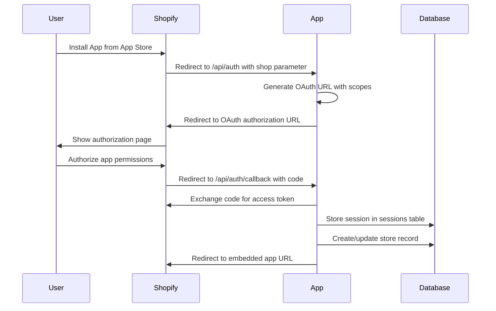

# 🔐 Shopify App Authentication Guide

This guide explains the complete authentication flow, session management, and multi-tenant architecture of the Shopify app boilerplate.

## 📋 Table of Contents

- [OAuth Flow Overview](#oauth-flow-overview)
- [Session Management](#session-management)
- [Multi-Tenant Architecture](#multi-tenant-architecture)
- [Database Schema](#database-schema)
- [Middleware Protection](#middleware-protection)
- [Security Considerations](#security-considerations)
- [Troubleshooting](#troubleshooting)

## 🔄 OAuth Flow Overview

### 1. App Installation Process



### 2. OAuth Implementation

#### OAuth Controller (`app/Http/Controllers/ShopifyOAuthController.php`)

```php
<?php

namespace App\Http\Controllers;

use Shopify\Auth\OAuth;
use Shopify\Context;
use Shopify\Utils;

class ShopifyOAuthController extends Controller
{
    /**
     * Start OAuth flow
     */
    public function auth(Request $request)
    {
        $shop = Utils::sanitizeShopDomain($request->query('shop'));
        
        // Delete any incomplete OAuth sessions
        Session::where('shop', $shop)
               ->where('access_token', null)
               ->delete();

        return AuthRedirection::redirect($request);
    }

    /**
     * Handle OAuth callback
     */
    public function callback(Request $request)
    {
        $session = OAuth::callback(
            $request->cookie(),
            $request->query(),
            ['App\Lib\CookieHandler', 'saveShopifyCookie'],
        );

        $host = $request->query('host');
        $shop = Utils::sanitizeShopDomain($request->query('shop'));

        // Register webhooks
        $response = Registry::register('/api/webhooks', Topics::APP_UNINSTALLED, $shop, $session->getAccessToken());
        
        if ($response->isSuccess()) {
            Log::debug("Registered APP_UNINSTALLED webhook for shop $shop");
        }

        $redirectUrl = Utils::getEmbeddedAppUrl($host);
        
        // Check billing if required
        if (Config::get('shopify.billing.required')) {
            list($hasPayment, $confirmationUrl) = EnsureBilling::check($session, Config::get('shopify.billing'));
            if (!$hasPayment) {
                $redirectUrl = $confirmationUrl;
            }
        }

        return redirect($redirectUrl);
    }
}
```

## 💾 Session Management

### Custom Session Storage (`app/Lib/DbSessionStorage.php`)

The app uses a custom session storage implementation that automatically handles multi-tenant store creation:

```php
<?php

namespace App\Lib;

use Shopify\Auth\Session;
use Shopify\Context;
use App\Models\Store;
use App\Api\Shopify\Shop;

class DbSessionStorage implements SessionStorage
{
    /**
     * Store session and automatically create store record
     */
    public function storeSession(Session $session): bool
    {
        // Store session in sessions table
        $sessionModel = \App\Models\Session::updateOrCreate(
            ['shop' => $session->getShop()],
            [
                'state' => $session->getState(),
                'is_online' => $session->isOnline(),
                'scope' => $session->getScope(),
                'expires' => $session->getExpires(),
                'access_token' => $session->getAccessToken(),
                'user_id' => $session->getUserId(),
                'user_first_name' => $session->getUserFirstName(),
                'user_last_name' => $session->getUserLastName(),
                'user_email' => $session->getUserEmail(),
                'account_owner' => $session->isAccountOwner(),
                'locale' => $session->getLocale(),
                'collaborator' => $session->isCollaborator(),
                'email_verified' => $session->isEmailVerified(),
            ]
        );

        // Automatically create/update store record
        $this->createOrUpdateStore($session);

        return true;
    }

    /**
     * Load session from database
     */
    public function loadSession(string $sessionId): ?Session
    {
        $sessionModel = \App\Models\Session::where('shop', $sessionId)->first();
        
        if (!$sessionModel) {
            return null;
        }

        return new Session(
            $sessionModel->shop,
            $sessionModel->access_token,
            $sessionModel->scope,
            $sessionModel->expires,
            $sessionModel->user_id,
            $sessionModel->user_first_name,
            $sessionModel->user_last_name,
            $sessionModel->user_email,
            $sessionModel->account_owner,
            $sessionModel->locale,
            $sessionModel->collaborator,
            $sessionModel->email_verified
        );
    }

    /**
     * Delete session and associated store data
     */
    public function deleteSession(string $sessionId): bool
    {
        \App\Models\Session::where('shop', $sessionId)->delete();
        Store::where('store_url', $sessionId)->delete();
        
        return true;
    }

    /**
     * Automatically create or update store record
     */
    private function createOrUpdateStore(Session $session): void
    {
        // Check if store already exists
        $existingStore = Store::where('store_url', $session->getShop())->first();
        
        if (!$existingStore) {
            // Fetch shop details from Shopify API
            $shopApi = new Shop();
            $shopApi->initialize($session->getShop(), $session->getAccessToken());
            $shopData = $shopApi->getShopDetails();

            // Create new store record
            Store::create([
                'uuid' => Str::uuid(),
                'store_url' => $session->getShop(),
                'store_name' => $shopData['name'] ?? null,
                'access_token' => $session->getAccessToken(),
                'scope' => $session->getScope(),
                'email' => $shopData['email'] ?? null,
                'domain' => $shopData['myshopifyDomain'] ?? null,
                'province' => $shopData['billingAddress']['province'] ?? null,
                'country' => $shopData['billingAddress']['country'] ?? null,
                'address1' => $shopData['billingAddress']['address1'] ?? null,
                'zip' => $shopData['billingAddress']['zip'] ?? null,
                'city' => $shopData['billingAddress']['city'] ?? null,
                'phone' => $shopData['billingAddress']['phone'] ?? null,
                'primary_locale' => $shopData['primaryLocale'] ?? null,
            ]);
        } else {
            // Update existing store with new access token
            $existingStore->update([
                'access_token' => $session->getAccessToken(),
                'scope' => $session->getScope(),
            ]);
        }
    }
}
```

## 🏢 Multi-Tenant Architecture

### Database Schema

#### Sessions Table
```sql
CREATE TABLE sessions (
    id BIGINT PRIMARY KEY AUTO_INCREMENT,
    shop VARCHAR(255) NOT NULL UNIQUE,
    state VARCHAR(255) NOT NULL,
    is_online BOOLEAN DEFAULT FALSE,
    scope VARCHAR(1024),
    expires TIMESTAMP NULL,
    access_token VARCHAR(255),
    user_id BIGINT NULL,
    user_first_name VARCHAR(255),
    user_last_name VARCHAR(255),
    user_email VARCHAR(255),
    account_owner BOOLEAN DEFAULT FALSE,
    locale VARCHAR(255),
    collaborator BOOLEAN DEFAULT FALSE,
    email_verified BOOLEAN DEFAULT FALSE,
    created_at TIMESTAMP DEFAULT CURRENT_TIMESTAMP,
    updated_at TIMESTAMP DEFAULT CURRENT_TIMESTAMP ON UPDATE CURRENT_TIMESTAMP,
    
    INDEX idx_shop (shop),
    INDEX idx_access_token (access_token),
    INDEX idx_expires (expires)
);
```

#### Stores Table
```sql
CREATE TABLE stores (
    id BIGINT PRIMARY KEY AUTO_INCREMENT,
    uuid CHAR(36) UNIQUE NOT NULL,
    store_url VARCHAR(255) UNIQUE NOT NULL,
    store_name VARCHAR(255),
    access_token VARCHAR(255),
    scope VARCHAR(1024),
    email VARCHAR(255),
    domain VARCHAR(255),
    province VARCHAR(255),
    country VARCHAR(255),
    address1 VARCHAR(255),
    zip VARCHAR(255),
    city VARCHAR(255),
    phone VARCHAR(255),
    latitude DECIMAL(10,8),
    longitude DECIMAL(11,8),
    primary_locale VARCHAR(255),
    address2 VARCHAR(255),
    created_at TIMESTAMP DEFAULT CURRENT_TIMESTAMP,
    updated_at TIMESTAMP DEFAULT CURRENT_TIMESTAMP ON UPDATE CURRENT_TIMESTAMP,
    
    INDEX idx_store_url (store_url),
    INDEX idx_uuid (uuid),
    INDEX idx_access_token (access_token)
);
```

### Store Model (`app/Models/Store.php`)

```php
<?php

namespace App\Models;

use Illuminate\Database\Eloquent\Model;
use App\Traits\UuidTrait;

class Store extends Model
{
    use UuidTrait;

    protected $primaryKey = 'id';
    public $incrementing = true;

    protected $fillable = [
        'uuid',
        'store_url',
        'store_name',
        'access_token',
        'scope',
        'email',
        'domain',
        'province',
        'country',
        'address1',
        'zip',
        'city',
        'phone',
        'latitude',
        'longitude',
        'primary_locale',
        'address2',
    ];

    protected $hidden = [
        'access_token', // Hide sensitive data
    ];

    /**
     * Get the session associated with this store
     */
    public function session()
    {
        return $this->hasOne(Session::class, 'shop', 'store_url');
    }

    /**
     * Scope queries to a specific store
     */
    public function scopeForStore($query, $storeUrl)
    {
        return $query->where('store_url', $storeUrl);
    }

    /**
     * Check if store has valid access token
     */
    public function hasValidToken(): bool
    {
        return !empty($this->access_token);
    }
}
```

## 🛡️ Middleware Protection

### Shopify Authentication Middleware

The app uses Shopify's built-in authentication middleware to protect API routes:

```php
// routes/api.php
Route::middleware('shopify.auth')->group(function () {
    Route::get('/shop/info', [ShopController::class, 'getShopInfo']);
    Route::get('/products', [ShopController::class, 'getProducts']);
});
```

### Custom Middleware (`app/Http/Middleware/EnsureShopifySession.php`)

```php
<?php

namespace App\Http\Middleware;

use Shopify\Utils;
use Shopify\Context;

class EnsureShopifySession
{
    public function handle($request, \Closure $next)
    {
        $session = Utils::loadCurrentSession(
            $request->getHeaderLine('Authorization'),
            $request->getCookieParams(),
            $request->getQueryParams(),
        );

        if (!$session) {
            return response()->json([
                'error' => 'No valid session found'
            ], 401);
        }

        // Add session to request for controllers
        $request->attributes->set('shopifySession', $session);

        return $next($request);
    }
}
```

### Controller Usage

```php
<?php

namespace App\Http\Controllers;

use Illuminate\Http\Request;
use App\Models\Store;

class ShopController extends Controller
{
    public function getShopInfo(Request $request)
    {
        // Get session from middleware
        $session = $request->get('shopifySession');
        
        // Get store for multi-tenant isolation
        $store = Store::where('store_url', $session->getShop())->first();
        
        if (!$store) {
            return response()->json([
                'success' => false,
                'error' => 'Store not found'
            ], 404);
        }

        // All operations are now scoped to this store
        // ... your API logic here
    }
}
```

## 🔒 Security Considerations

### 1. Access Token Security

- **Encryption**: Access tokens are stored in plain text (consider encryption for production)
- **Scope Limitation**: Only request necessary scopes
- **Token Rotation**: Implement token refresh mechanisms
- **Secure Storage**: Use environment variables for API secrets

### 2. Session Security

```php
// Session configuration
'session' => [
    'driver' => 'database',
    'lifetime' => 120, // 2 hours
    'expire_on_close' => true,
    'secure' => true, // HTTPS only
    'http_only' => true,
    'same_site' => 'lax',
],
```

### 3. CSRF Protection

```php
// Verify CSRF token for non-GET requests
Route::middleware(['shopify.auth', 'verify.shopify.request'])->group(function () {
    Route::post('/your-endpoint', [YourController::class, 'method']);
});
```

### 4. Rate Limiting

```php
// Implement rate limiting for API endpoints
Route::middleware(['shopify.auth', 'throttle:60,1'])->group(function () {
    Route::get('/api/endpoint', [Controller::class, 'method']);
});
```

## 🔧 Troubleshooting

### Common Authentication Issues

#### 1. "Missing Authorization key in headers array"

**Cause**: Accessing app directly via localhost instead of Shopify admin

**Solution**: 
- Access app through Shopify admin: `https://your-store.myshopify.com/admin/apps/your-app-name`
- Ensure proper session cookies are present

#### 2. "No valid session found"

**Cause**: Session expired or invalid

**Solution**:
```bash
# Check session in database
php artisan tinker
>>> App\Models\Session::where('shop', 'your-store.myshopify.com')->first();

# Clear expired sessions
php artisan session:gc
```

#### 3. "Store not found"

**Cause**: Store record not created during OAuth

**Solution**:
```php
// Manually create store record
$store = new Store();
$store->store_url = 'your-store.myshopify.com';
$store->access_token = 'your-access-token';
$store->save();
```

#### 4. OAuth Callback Errors

**Debug OAuth flow**:
```php
// Add logging to OAuth controller
Log::info('OAuth callback', [
    'shop' => $request->query('shop'),
    'code' => $request->query('code'),
    'state' => $request->query('state'),
]);
```

### Debug Commands

```bash
# Check session storage
php artisan tinker
>>> App\Models\Session::all();

# Check store records
>>> App\Models\Store::all();

# Clear all sessions
>>> App\Models\Session::truncate();

# Test GraphQL API
curl -X POST https://your-store.myshopify.com/admin/api/2025-01/graphql.json \
  -H "X-Shopify-Access-Token: your-access-token" \
  -H "Content-Type: application/json" \
  -d '{"query": "{ shop { name } }"}'
```

### Environment Variables

Ensure these are properly set:

```env
SHOPIFY_API_KEY=your_api_key
SHOPIFY_API_SECRET=your_api_secret
SHOPIFY_APP_SCOPES=read_products,write_products
SHOPIFY_APP_HOST_NAME=your-app-domain.com
SESSION_DRIVER=database
SESSION_LIFETIME=120
```

## 📚 Additional Resources

- [Shopify OAuth Documentation](https://shopify.dev/docs/apps/auth/oauth)
- [Shopify Session Management](https://shopify.dev/docs/apps/auth/oauth/session-tokens)
- [Laravel Session Configuration](https://laravel.com/docs/session)
- [Database Security Best Practices](https://laravel.com/docs/security)

---

**This authentication system provides secure, scalable multi-tenant architecture for Shopify apps.** 🔐 