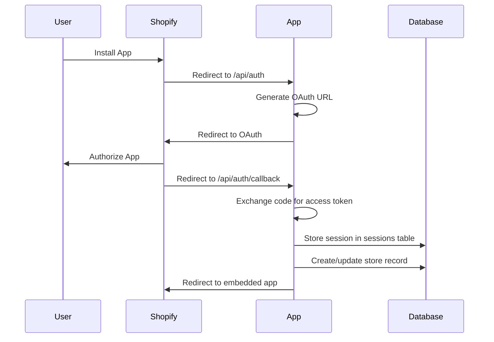

# 🚀 Shopify App Boilerplate

A clean, production-ready Shopify app boilerplate built with **Laravel 11** (backend) and **React** (frontend) using **GraphQL Admin API**.

## 📋 Table of Contents

- [Features](#-features)
- [Quick Start](#-quick-start)
- [Project Structure](#-project-structure)
- [Authentication Flow](#-authentication-flow)
- [Multi-Tenant Architecture](#-multi-tenant-architecture)
- [API Documentation](#-api-documentation)
- [Development Guide](#-development-guide)
- [Deployment](#-deployment)
- [Troubleshooting](#-troubleshooting)

## ✨ Features

- ✅ **GraphQL Admin API Integration** - Uses Shopify's GraphQL API instead of REST
- ✅ **Shopify Authentication** - OAuth flow with session management
- ✅ **Multi-Tenant Architecture** - Automatic store management
- ✅ **React Frontend** - Modern UI with Shopify Polaris 13.9.5
- ✅ **Laravel Backend** - Robust API with middleware protection
- ✅ **Docker Support** - Containerized development environment
- ✅ **Error Handling** - Comprehensive error management
- ✅ **Session Storage** - Database-backed session management

## 🚀 Quick Start

### Prerequisites

- PHP 8.2+
- Node.js 18+
- Docker & Docker Compose
- Shopify Partner Account
- ngrok or similar tunnel service

### 1. Clone and Setup

```bash
# Clone the repository
git clone <your-repo-url>
cd shopify-discount-rules

# Run the setup script
chmod +x setup-boilerplate.sh
./setup-boilerplate.sh
```

### 2. Environment Configuration

Create `.env` file in the `web/` directory:

```env
APP_NAME="Your App Name"
APP_ENV=local
APP_KEY=base64:your-generated-key
APP_DEBUG=true
APP_URL=http://localhost:8000

DB_CONNECTION=pgsql
DB_HOST=postgres
DB_PORT=5432
DB_DATABASE=shopify_app
DB_USERNAME=postgres
DB_PASSWORD=password

SHOPIFY_API_KEY=your_shopify_api_key
SHOPIFY_API_SECRET=your_shopify_api_secret
SHOPIFY_APP_SCOPES=read_products,write_products,read_orders,write_orders
SHOPIFY_APP_HOST_NAME=your-ngrok-url.ngrok.io
```

### 3. Start Development Environment

```bash
# Start Docker containers
docker-compose up -d

# Install frontend dependencies
cd web/frontend
npm install

# Start frontend development server
npm run dev

# In another terminal, start Laravel
cd web
php artisan serve
```

### 4. Install App in Shopify Store

1. Go to your Shopify Partner Dashboard
2. Create a new app or use existing app
3. Set App URL to: `https://your-ngrok-url.ngrok.io`
4. Set Allowed redirection URLs to: `https://your-ngrok-url.ngrok.io/api/auth/callback`
5. Install the app in a development store

## 📁 Project Structure

```
shopify-discount-rules/
├── web/                          # Laravel Backend
│   ├── app/
│   │   ├── Api/Shopify/          # GraphQL API Classes
│   │   │   ├── Shop.php          # Shop-related queries
│   │   │   ├── Products.php      # Product-related queries
│   │   │   ├── Collections.php   # Collection-related queries
│   │   │   └── Traits/
│   │   │       └── ShopifyBase.php # Base GraphQL client
│   │   ├── Http/Controllers/
│   │   │   ├── ShopController.php    # Boilerplate API endpoints
│   │   │   ├── ShopifyOAuthController.php # OAuth handling
│   │   │   └── Controller.php        # Base controller
│   │   ├── Models/
│   │   │   ├── Store.php         # Multi-tenant store model
│   │   │   └── Session.php       # Shopify session model
│   │   └── Lib/
│   │       └── DbSessionStorage.php # Custom session storage
│   ├── routes/
│   │   ├── api.php               # API routes
│   │   └── web.php               # Web routes
│   └── database/migrations/      # Database migrations
├── frontend/                     # React Frontend
│   ├── Pages/
│   │   ├── Dashboard.jsx         # Main dashboard
│   │   └── ExitIframe.jsx        # Exit iframe handler
│   ├── Routes/
│   │   └── Route.jsx             # React Router configuration
│   ├── api.js                    # API client
│   └── App.jsx                   # Main app component
└── docker-compose.yml            # Docker configuration
```

## 🔐 Authentication Flow

### 1. OAuth Installation Process



### 2. Session Management

The app uses a custom `DbSessionStorage` class that:

- **Stores sessions** in the `sessions` table
- **Automatically creates** store records in the `stores` table
- **Handles session retrieval** for API requests
- **Manages session expiration** and cleanup

### 3. Middleware Protection

```php
// API routes protected by Shopify authentication
Route::middleware('shopify.auth')->group(function () {
    Route::get('/shop/info', [ShopController::class, 'getShopInfo']);
    Route::get('/products', [ShopController::class, 'getProducts']);
});
```

## 🏢 Multi-Tenant Architecture

### Database Schema

#### Sessions Table
```sql
CREATE TABLE sessions (
    id BIGINT PRIMARY KEY,
    shop VARCHAR(255) NOT NULL,
    state VARCHAR(255) NOT NULL,
    is_online BOOLEAN DEFAULT FALSE,
    scope VARCHAR(1024),
    expires TIMESTAMP,
    access_token VARCHAR(255),
    user_id BIGINT,
    user_first_name VARCHAR(255),
    user_last_name VARCHAR(255),
    user_email VARCHAR(255),
    account_owner BOOLEAN,
    locale VARCHAR(255),
    collaborator BOOLEAN,
    email_verified BOOLEAN,
    created_at TIMESTAMP,
    updated_at TIMESTAMP
);
```

#### Stores Table
```sql
CREATE TABLE stores (
    id BIGINT PRIMARY KEY,
    uuid UUID UNIQUE NOT NULL,
    store_url VARCHAR(255) UNIQUE NOT NULL,
    store_name VARCHAR(255),
    access_token VARCHAR(255),
    scope VARCHAR(1024),
    email VARCHAR(255),
    domain VARCHAR(255),
    province VARCHAR(255),
    country VARCHAR(255),
    address1 VARCHAR(255),
    zip VARCHAR(255),
    city VARCHAR(255),
    phone VARCHAR(255),
    latitude DECIMAL(10,8),
    longitude DECIMAL(11,8),
    primary_locale VARCHAR(255),
    address2 VARCHAR(255),
    created_at TIMESTAMP,
    updated_at TIMESTAMP
);
```

### Automatic Store Creation

When a session is stored, the `DbSessionStorage` automatically:

1. **Creates/updates** store record in `stores` table
2. **Links session** to store via `store_url`
3. **Stores access token** for API calls
4. **Maintains multi-tenant isolation**

### Store Isolation

Each API request is automatically scoped to the current store:

```php
// In controllers
$session = $request->get('shopifySession');
$store = Store::where('store_url', $session->getShop())->first();

// All operations are scoped to this store
```

## 📡 API Documentation

### GraphQL API Classes

#### Shop API (`app/Api/Shopify/Shop.php`)

```php
// Get shop details with product count
$shopApi = new Shop();
$shopApi->initialize($session->getShop(), $session->getAccessToken());
$result = $shopApi->getShopDetailsWithProductCount();
```

**GraphQL Query:**
```graphql
{
  shop {
    id
    name
    myshopifyDomain
    email
    plan {
      displayName
    }
  }
  productsCount {
    count
  }
}
```

#### Products API (`app/Api/Shopify/Products.php`)

```php
// Get products with pagination
$productsApi = new Products();
$productsApi->initialize($session->getShop(), $session->getAccessToken());
$products = $productsApi->getProducts(10);
```

**GraphQL Query:**
```graphql
{
  products(first: 10) {
    edges {
      node {
        id
        title
        status
        variants(first: 1) {
          nodes {
            price
          }
        }
      }
    }
    pageInfo {
      hasNextPage
    }
  }
}
```

### REST API Endpoints

#### Get Shop Information
```http
GET /api/shop/info
Authorization: Bearer {access_token}
```

**Response:**
```json
{
  "success": true,
  "data": {
    "shop": {
      "id": "gid://shopify/Shop/123",
      "name": "My Store",
      "myshopifyDomain": "my-store.myshopify.com",
      "email": "admin@mystore.com",
      "plan": {
        "displayName": "Basic Plan"
      }
    },
    "products_count": 25,
    "timestamp": "2025-01-07T10:30:00Z"
  }
}
```

#### Get Products
```http
GET /api/products?first=10&after=cursor
Authorization: Bearer {access_token}
```

**Response:**
```json
{
  "success": true,
  "data": {
    "edges": [
      {
        "node": {
          "id": "gid://shopify/Product/123",
          "title": "Sample Product",
          "status": "ACTIVE",
          "variants": {
            "nodes": [
              {
                "price": "19.99"
              }
            ]
          }
        }
      }
    ],
    "pageInfo": {
      "hasNextPage": true
    },
    "totalCount": 25
  }
}
```

## 🛠️ Development Guide

### Adding New API Endpoints

1. **Create GraphQL API Class:**
```php
// app/Api/Shopify/YourApi.php
class YourApi
{
    use ShopifyBase;

    public function getYourData(): array
    {
        $query = <<<QUERY
        {
          yourQuery {
            field1
            field2
          }
        }
        QUERY;

        $response = $this->post('graphql.json', ['query' => $query]);
        return $response->json()['data'] ?? [];
    }
}
```

2. **Create Controller Method:**
```php
// app/Http/Controllers/YourController.php
public function getYourData(Request $request)
{
    $session = $request->get('shopifySession');
    
    $api = new YourApi();
    $api->initialize($session->getShop(), $session->getAccessToken());
    
    $data = $api->getYourData();
    
    return response()->json([
        'success' => true,
        'data' => $data
    ]);
}
```

3. **Add Route:**
```php
// routes/api.php
Route::middleware('shopify.auth')->group(function () {
    Route::get('/your-endpoint', [YourController::class, 'getYourData']);
});
```

4. **Add Frontend Component:**
```jsx
// frontend/Pages/YourPage.jsx
import { apiClient } from '../api';

const handleGetData = async () => {
    const { status, data } = await apiClient("GET", "/your-endpoint", []);
    // Handle response
};
```

### Frontend Development

#### Using the API Client

```jsx
import { apiClient } from '../api';

// GET request
const { status, data } = await apiClient("GET", "/shop/info", []);

// POST request
const { status, data } = await apiClient("POST", "/your-endpoint", {
    key: "value"
});
```

#### Polaris Components

The boilerplate uses Shopify Polaris 13.9.5. Available components:

```jsx
import { 
    Card, 
    Page, 
    Layout, 
    Text, 
    Button,
    Banner,
    Spinner
} from "@shopify/polaris";
```

## 🚀 Deployment

### Production Environment Variables

```env
APP_ENV=production
APP_DEBUG=false
APP_URL=https://your-app-domain.com

DB_CONNECTION=pgsql
DB_HOST=your-db-host
DB_PORT=5432
DB_DATABASE=your_db_name
DB_USERNAME=your_db_user
DB_PASSWORD=your_db_password

SHOPIFY_API_KEY=your_production_api_key
SHOPIFY_API_SECRET=your_production_api_secret
SHOPIFY_APP_SCOPES=read_products,write_products
SHOPIFY_APP_HOST_NAME=your-app-domain.com
```

### Deployment Steps

1. **Build Frontend:**
```bash
cd web/frontend
npm run build
```

2. **Deploy Laravel:**
```bash
cd web
composer install --optimize-autoloader --no-dev
php artisan config:cache
php artisan route:cache
php artisan view:cache
```

3. **Database Migration:**
```bash
php artisan migrate --force
```

## 🔧 Troubleshooting

### Common Issues

#### 1. "Missing Authorization key in headers array"

**Cause:** Accessing app directly via localhost instead of Shopify admin

**Solution:** Access app through Shopify admin: `https://your-store.myshopify.com/admin/apps/your-app-name`

#### 2. GraphQL Query Errors

**Cause:** Incorrect GraphQL query structure

**Solution:** Use Shopify's GraphQL schema explorer or check the API documentation

#### 3. Session Not Found

**Cause:** Session expired or invalid

**Solution:** Reinstall the app in the Shopify store

#### 4. Database Connection Issues

**Cause:** Incorrect database configuration

**Solution:** Check `.env` file and ensure database is running

### Debug Mode

Enable debug mode in `.env`:
```env
APP_DEBUG=true
```

Check Laravel logs:
```bash
tail -f web/storage/logs/laravel.log
```

### GraphQL Debugging

Add debug header to see query costs:
```php
// In ShopifyBase.php
protected function getHeaders(): array
{
    return [
        'Content-Type' => 'application/json',
        'Accept' => 'application/json',
        'X-Shopify-Access-Token' => $this->accessToken,
        'Shopify-GraphQL-Cost-Debug' => '1', // Add this for debugging
    ];
}
```

## 📚 Additional Resources

- [Shopify GraphQL Admin API](https://shopify.dev/api/admin-graphql)
- [Shopify App Development](https://shopify.dev/apps)
- [Laravel Documentation](https://laravel.com/docs)
- [React Documentation](https://react.dev)
- [Shopify Polaris](https://polaris.shopify.com)

## 🤝 Contributing

1. Fork the repository
2. Create a feature branch
3. Make your changes
4. Add tests if applicable
5. Submit a pull request

## 📄 License

This project is licensed under the MIT License - see the LICENSE file for details.

---

**Built with ❤️ for the Shopify developer community** 